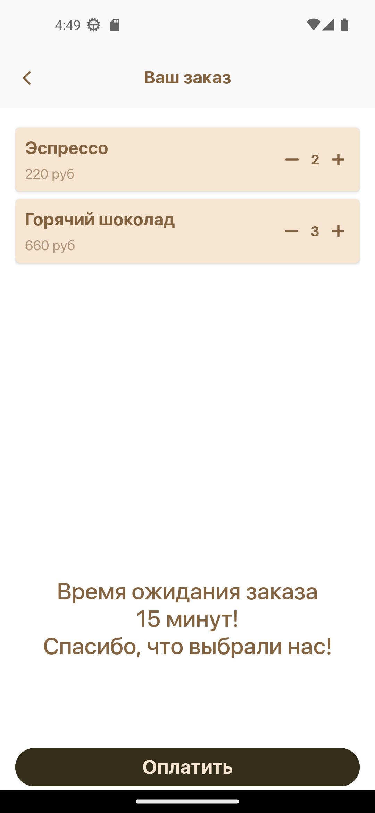

# Тестовое задание Seven Winds Studio

## О проекте

Данный проект был разработан, как тестовое задание на вакансию Android Developer.

### Задачи, которые стояли при разработке:

- Сверстать экраны мобильного приложения;
- Подключить API;
- Залить в Github и расшарить доступ.

## Технический стек:

- Kotlin
- Clean Architecture
- MVVM
- ViewBinding

### Библиотеки:

- Coroutines
- Lifecycle(LiveData, ViewModel)
- Navigation
- Glide
- Room
- Retrofit
- GSON
- OkHttp
- Yandex Maps API

## Скриншоты

  
  
  

 

  
  
  

 

